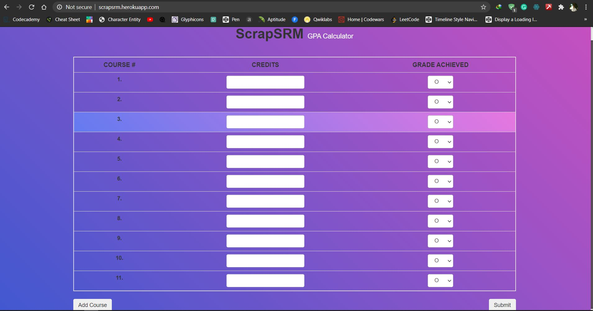
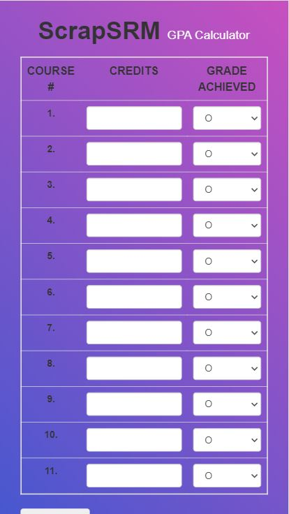

# GPA-Calculator-ScrapSRM

_A Responsive GPA Calculator Website for SRMITEs._  

CGPA Calculator designed in accordance with SRM Institute of Science and Technology. Student can use this calculator to calculate grade point average (GPA) and generate a GPA report.

For this project, I had used the following tech tools - 

- HTML5 / CSS3 / Javascript (jQuery - Library and Bootstrap 4 - Framework)

- Hosting on Free Servers - Heroku (using CLI Commands)  

## Screenshots  

